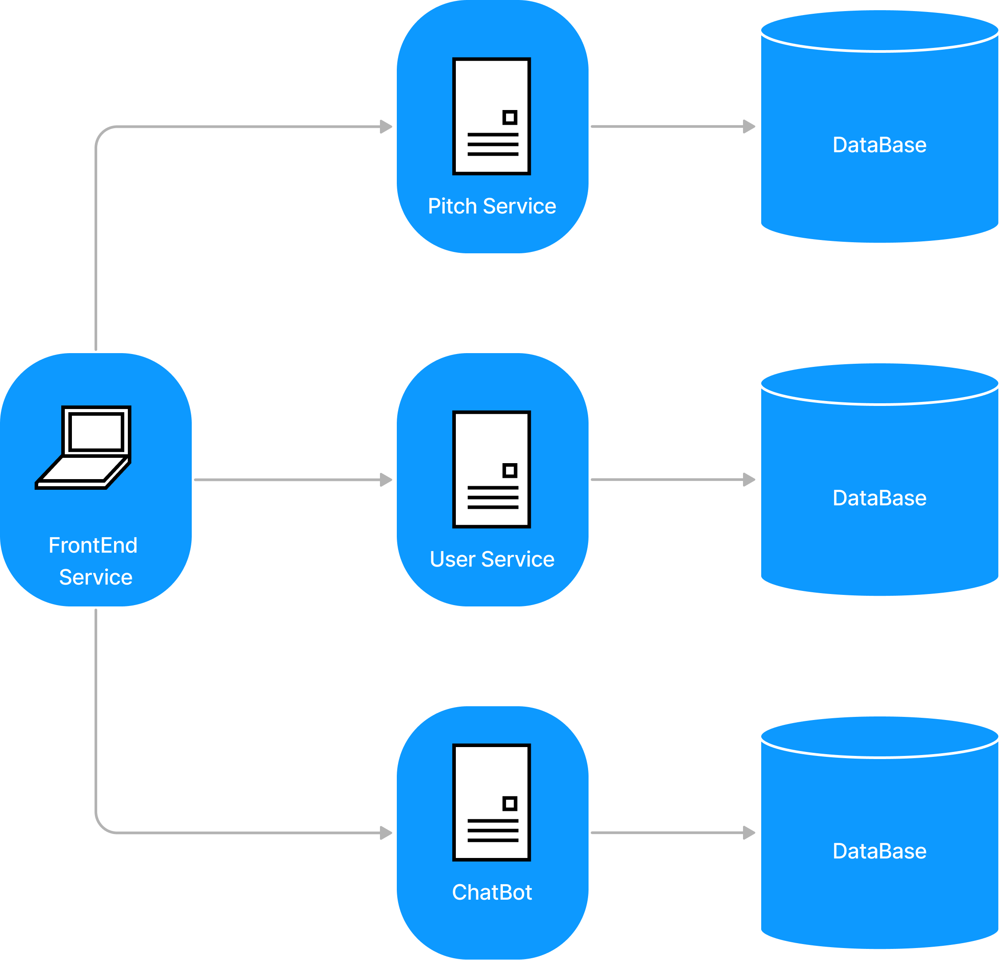

# Arquitetura

## 1. Introdução

### 1.1. Finalidade

Este documento tem como objetivo fornecer uma visão geral da arquitetura do sistema web Pitch It!. Apresenta de forma clara o fluxo de dados, o comportamento da aplicação e como as partes se relacionam, bem como expor de maneira objetiva as decisões arquiteturais que foram tomadas em relação ao projeto.

### 1.2. Escopo

Este documento de arquitetura se aplica ao Pitch It!. Estão descritos neste documento os padrões de arquitetura adotados, frameworks e linguagens escolhidas.

### 1.3. Definições, Acrônimos e Abreviações

* **API** - *Application Programming Interface*: conjunto de rotinas e padrões de programação que viabiliza a comunicação entre dois sistemas ou plataformas distintas.
* **HTTP** - *Hypertext Transfer Protocol*: protocolo de transferência e comunicação de dados.
* **Backend** - Parte da aplicação responsável pela conexão com o banco de dados e gerência das informações que serão enviadas ao frontend.
* **Frontend** - Parte da aplicação responsável pela interação com o usuário, utilizando recursos consumidos do backend.
* **SSP** - Secretaria de Estado de Segurança Pública.
* **SQL** - *Structured Query Language*: Linguagem declarativa de busca para bancos de dados relacionais.
* **JSON** - JavaScript Object Notation
* **REST** - Representational State Sransfer

## 2. Representação Geral da Arquitetura

A aplicação tem um cliente de frontend web feito em React com auxílio do vite e três microserviços em seu backend.

O primeiro microserviço é o Pitch Service, uma API REST que encaminha a mensagem escrita pelo usuário descrevendo sua startup para uma IA com linguagem natural que entende o contexto e a partir dele gera um pitch de 5 minutos utilizando engenharia de prompt. 

O segundo microserviço é o Chatbot Service, uma API REST que encaminha as dúvidas descritas pelo usuário logado para uma IA com linguagem natural que entende o contexto e devolve com a melhor resposta disponível.

O terceiro microserviço é o User Service, que trata todos os dados dos usuários os enviando para serem armazenados em um banco de dados relacional, MySQL.

As comunicações entre todos os componentes são feitas com o protocolo HTTP e o tipo de conteúdo transmitido dentro do sistema é documento JSON.

## 3. Tecnologias
O diagrama abaixo mostra quais são as tecnologias usadas em cada parte do sistema. Em seguida, essas tecnologias são descritas brevemente.

### 3.1. React
[React](https://reactjs.org/) é uma biblioteca JavaScript desenvolvida pelo Facebook para criar interfaces de usuário (UIs) dinâmicas e interativas. Utiliza uma abordagem baseada em componentes, permitindo que desenvolvedores construam componentes encapsulados que gerenciam seu próprio estado e se combinam para formar interfaces complexas.

### 3.2. Vite
[Vite](https://vitejs.dev/) é uma ferramenta de build desenvolvida por Evan You, o criador do Vue.js, que oferece uma experiência de desenvolvimento rápida e eficiente para projetos web. Ele utiliza ESBuild para iniciar um servidor de desenvolvimento quase instantaneamente e oferece Hot Module Replacement (HMR) para atualizações de código em tempo real.

### 3.3. Tailwind CSS
[Tailwind CSS](https://tailwindcss.com/) é um framework CSS utilitário que facilita a criação de designs modernos e responsivos sem escrever CSS personalizado. Em vez de classes pré-estilizadas, Tailwind oferece uma vasta coleção de classes utilitárias de baixo nível que podem ser combinadas diretamente no HTML para construir qualquer design de forma eficiente.

### 3.4. MySQL
[MySQL](https://mysql.com/) MySQL é um sistema de gerenciamento de banco de dados relacional (RDBMS) open-source amplamente utilizado, desenvolvido pela Oracle Corporation. Utiliza a linguagem SQL (Structured Query Language) para gerenciar e manipular dados em tabelas relacionais. MySQL é conhecido por sua alta performance, confiabilidade e facilidade de uso, sendo uma escolha popular para aplicações web, desde pequenos sites até grandes plataformas de e-commerce.

## 4. Requisitos e Restrições de Arquitetura

* Aplicação deve ser construída baseada na arquitetura de microsserviços, na qual o backend será desenvolvido em Java e o frontend em Vite + React.

* O aplicativo será funcional em notebooks e desktops com qualquer sistema operacional que tenha acesso à um navegador.

* O desktop necessita de conexão estável de internet para uso completo e atualizado do aplicativo.

### 5. Frontend

O frontend está sendo implementado com uma organização em que cada módulo possui responsabilidades bem definidas, facilitando assim a manutenção e evolução do código:

* **App.tsx** - Arquivo que chama o componente principal do app que são as rotas.
* **src/** - Diretório que contém basicamente todo o código fonte.
* **routes.tsx** - Arquivo responsável por carregar todas as telas. Para isso ele utiliza os módulos de navigation e de screens.
* **navigation/** - Diretório que controla o fluxo de navegação entre as telas através *tab bottom bar*. Então ele faz uso do componente de screens.
* **screens/** - Contêm as telas da aplicação. Para que as telas funcionem corretamente, esse módulo utiliza os diretórios de services, de componentes e o de utils.
* **services/** - Diretório que contém os endpoints necessários para realizar as requisões feitas no app.
* **components/** - Inclue os componentes que são comuns às telas da aplicação. Os componentes podem ser modals, inputs de formulários, botões, etc.
* **utils/** - Armazena funções utilitárias reutilizáveis que serão disponibilizadas para todo o frontend. 
* **hooks/** - Diretório onde estão os gerenciandores de estado do usuário
* **@types/** - Onde ficam algumas tipagens internas customizadas 

## 6. Referências

JUNIOR, Cleber; LUI, Brian; HORINOUCHI, Lucas; SOUZA, Rômulo; HERONILDO, Francisco; TOYOSHIMA, Filipe; ALVES, Vitor; APOLINÁRIO, Jacó. Projeto HubCare: Documento de Arquitetura. Disponível em: https://cjjcastro.gitlab.io/2019-1-hubcare-docs/project/architecture-document/#5-visao-de-implementacao. 
LIMA, Alan; BERNARDO, Elias; MARQUES, Guilherme; BARREIROS, Leonardo; BLANCO, Matheus; FÉO, Pedro; RODRIGUES, Pedro; KADER, Saleh; SILVA, Sara; ALCÂNTARA, Shayane. Projeto QR Comer: Documento de Arquitetura. Disponível em: https://fga-desenho-2019-2.github.io/Wiki/seminario5/arquitetura/. 

MENDES, Iasmin; VALÉRIO, Renato; JOÃO, Lucas; DAVI, Gabriel; SOUZA, Sousa; MACIEL, Lucas; FERNANDES, Weiller; GOMES, Matheus. Projeto Indica AI: Documento de Arquitetura. Disponível em: https://fga-eps-mds.github.io/2018.2-IndicaAi//docs/2018/08/28/architecture-doc.html. 

MIGUEL, Alexandre; ALVES, Davi; GUEDES, Gabriela; GOULART, Helena; ROBSON, João; MENEZES, Leticia; GUILHERME, Luiz; SCHADT, Renan; VINICIUS, Rômulo; HUGO, Victor. Projeto Translate.me: Documento de Arquitetura. Disponível em: https://translate-me.github.io/docs/documentos/projeto/doc_de_arquitetura/. 

## Histórico de Revisão

| Data | Versão| Descrição | Autor |
|----|----|----|----|
| 25/06/2024 | 1.0 | Criação do documento | Lucas Lima Ferraz |