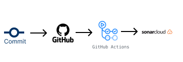

# Documento de Arquitetura DevOps

## 1. Introdução
Este documento tem como principal objetivo fornecer uma visão abrangente e estruturada da arquitetura DevOps. Ele descreve as principais decisões de design, componentes, módulos, interações e estrutura do software.

## 1.1. Visão Geral
Este documento está estruturado da seguinte forma:
- Plano de Arquitetura DevOps
- Estratégia de Implementação DevOps
- Diagrama de Arquitetura DevOps

## 2. Plano de Arquitetura DevOps
Um plano de arquitetura DevOps serve para integrar e automatizar os processos de desenvolvimento e operações, visando melhorar a colaboração entre equipes, aumentar a eficiência e acelerar a entrega de software. Ele detalha a estrutura tecnológica e os fluxos de trabalho necessários para implementar práticas DevOps, incluindo a automação de integração contínua (CI) e entrega contínua (CD), monitoramento, infraestrutura como código (IaC), e gestão de configurações. O objetivo é criar um ambiente de desenvolvimento ágil e responsivo, onde mudanças de código possam ser lançadas rapidamente e com alta qualidade, reduzindo o tempo de ciclo e aumentando a confiabilidade do sistema.

## 2.1. Tecnologias
### 2.1.1 GitHub
GitHub é uma plataforma de hospedagem de código para controle de versão e colaboração. Permite que vários desenvolvedores trabalhem juntos em projetos a partir de qualquer lugar.

### 2.1.2 Github Actions
Github Actions é um servidor de automação de códigos. Utilizado para automatizar diversas fases do processo de desenvolvimento de software como builds, testes e deploy, facilitando a integração contínua e entrega contínua (CI/CD).

### 2.1.3 SonarCloud
SonarCloud é uma plataforma de análise de qualidade de código online. Ajuda a detectar e corrigir problemas de qualidade, vulnerabilidades de segurança e bugs em código-fonte, suportando várias linguagens de programação.

## 3. Estratégia de Implementação DevOps

A estratégia de implementação DevOps descreve o processo integrado e as práticas que serão adotadas para facilitar a colaboração entre as equipes de desenvolvimento, operações e qualidade. O objetivo é automatizar e otimizar o processo de desenvolvimento de software, garantindo entregas mais rápidas e seguras.

### 3.1. Integração Contínua (CI)

1. **Controle de Versão:** Todo código-fonte e artefatos de configuração são mantidos no GitHub.
2. **Build Automatizado:** Ao realizar um push para o repositório no GitHub, o Github Actions é acionado automaticamente para executar builds do projeto.
3. **Testes Automatizados:** Durante o processo de build, o Github Actions executa uma série de testes automatizados para garantir a qualidade do código.
4. **Análise de Qualidade do Código:** Após os testes, o SonarCloud realiza uma análise detalhada do código para detectar problemas de qualidade e segurança.

### 3.2. Entrega Contínua (CD)

1. **Preparação de Ambiente:** Utilizando o Github Actions, ambientes são preparados e gerenciados  entre os ambientes de desenvolvimento, teste e produção.
2. **Deploy Automatizado:** Após a aprovação na fase de CI, o Github Actions automatiza o deploy das aplicações no ambiente.
3. **Monitoramento e Feedback:** Ferramentas de monitoramento são utilizadas para acompanhar o desempenho das aplicações em tempo real. 

## 4. Diagrama de Arquitetura DevOps

Segue o diagrama mostrando como funcionará o sistema, detalhando os fluxos de trabalho entre as ferramentas e os processos adotados para Integração Contínua (CI) e Entrega Contínua (CD).

## Histórico de Revisão

| Data | Versão| Descrição | Autor |
|----|----|----|----|
| 25/06/2024 | 1.0 | Criação do documento | Lucas Lima Ferraz |